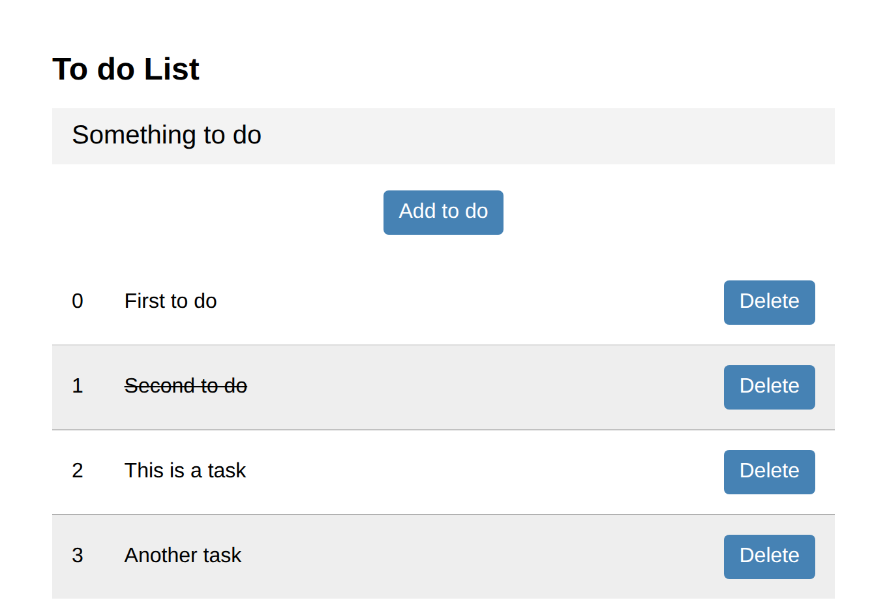

# To do list with Angular

A simple to do list app built with Angular 22, using standalone components and signals.



## Quick start

```bash
npm install
npm start
```

Then open http://localhost:4200.

## Documentation

Further reading lives in the [`docs`](docs/README.md) folder:

- [Getting started](docs/getting-started.md): requirements, setup and available scripts
- [Architecture](docs/architecture.md): project structure, components and data flow
- [Testing](docs/testing.md): how the unit tests are set up and how to run them
