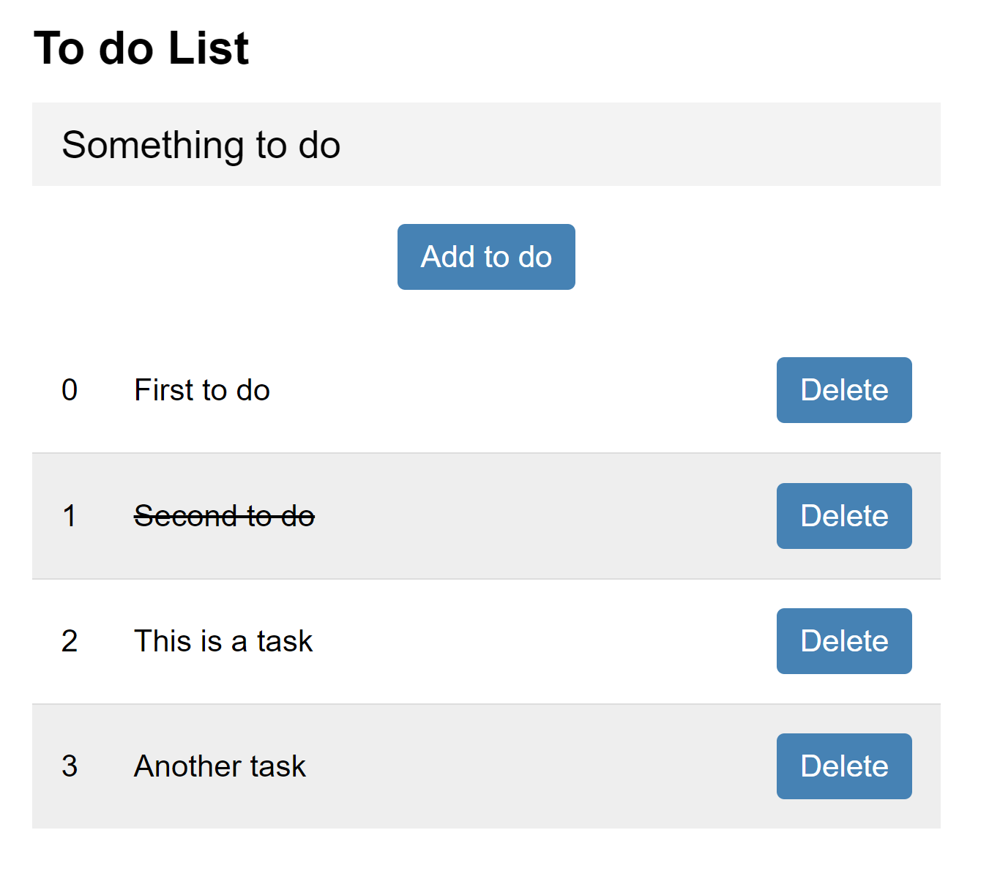

# To do list with Angular

This is a simple to do list app, made with Angular.

## Running the project

- Try having the latest stable version of Node
- Install Angular's CLI on your machine: Run ```$ npm i -g @angular/cli```
- Installing project's dependencies: Open project's folder and run: `$ npm i`
- Running the project in development mode(Using Angular's CLI): `$ ng serve`

## Print


